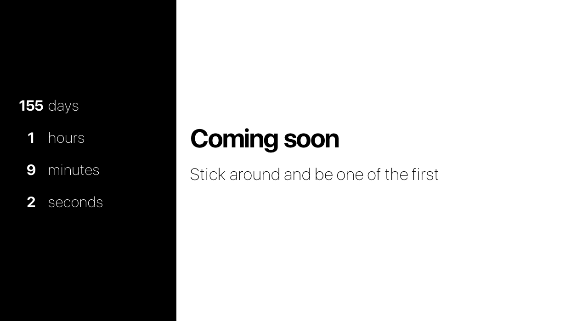
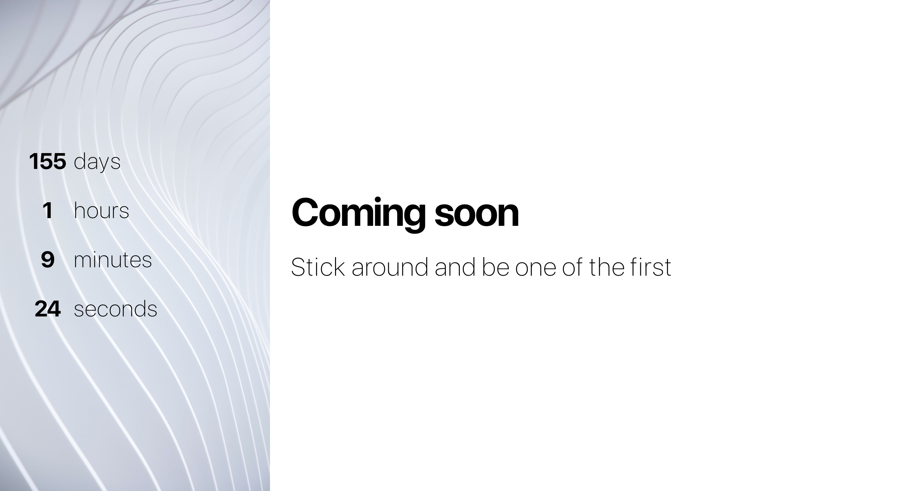
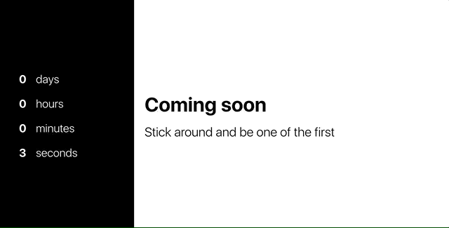

# Countdown component

Let's create a `Countdown` component.

It should accept a final date and display a countdown of days, hours, minutes and seconds.

It should have customizable title and lead text. Both of these should have reasonable default values.

It should accept an optional image. If no image is provided, a solid background color is displayed behind the counter.

It should allow for 2 themes: light and dark. The dark theme is default.

- dark theme: light text over dark background 

- light theme: dark text over light background 

Once the counter is done, the parent component should be alerted. 

